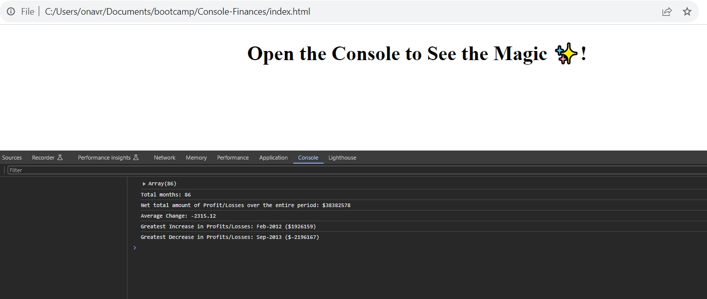

# Console-Finances JavaScript Task

A JavaScript task focusing on building a console-based  financial analysis tool

## Task Description

This is the solution for the challenge from EdX bootcamp, Week 4, Day 4. During Week 4 at the bootcamp, I learnt basic Javascript and my task was to apply the skills I got and write a JavaScript code that analyzes the records to calculate each of the following:

The total number of months included in the dataset.
The net total amount of Profit/Losses over the entire period.
The average of the changes in Profit/Losses over the entire period. You will need to track what the total change in Profit/Losses are from month to month and then find the average.
The greatest increase in Profit/Losses (date and amount) over the entire period.
The greatest decrease in Profit/Losses (date and amount) over the entire period.

## Requirements

- Basic knowledge of JavaScript.
- Understanding of basic financial concepts (net profit).

## Getting Started

To start working on the Console Finances JavaScript Task, follow these steps:

1. Clone the repository:

git clone https://github.com/elismountain/console-finances.git

## A screenshot of the application

